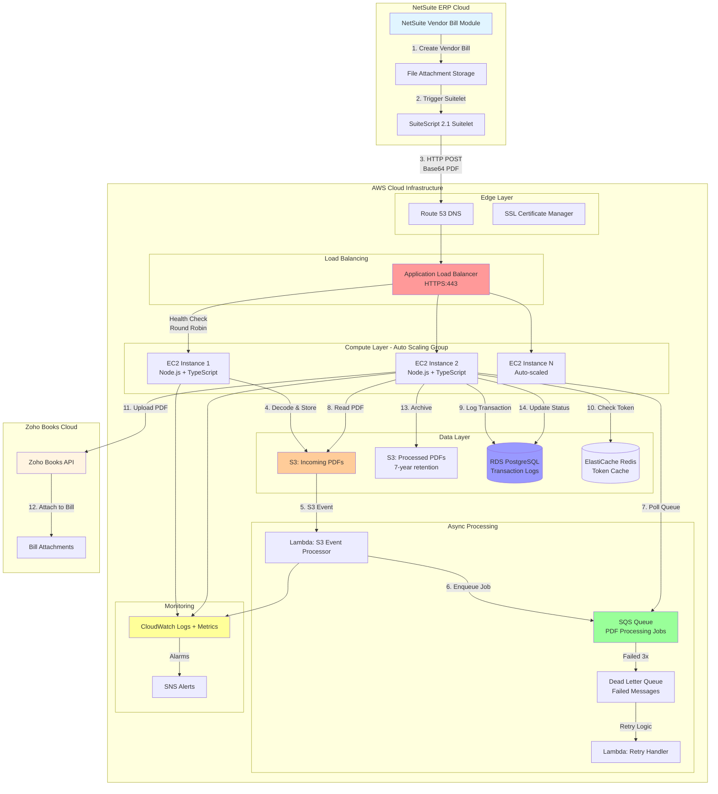
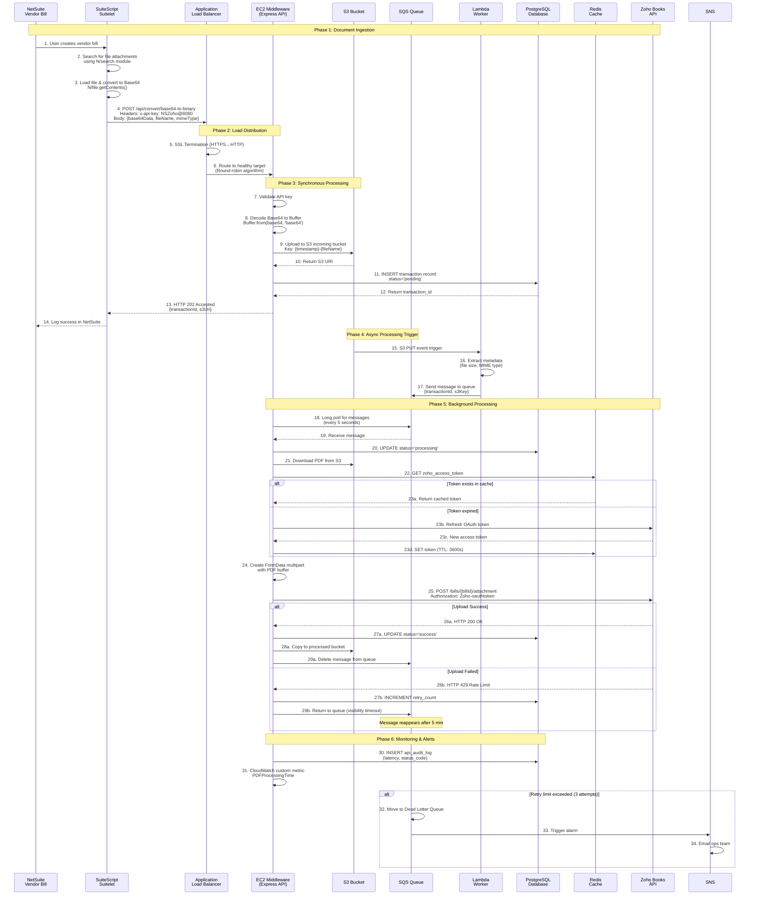
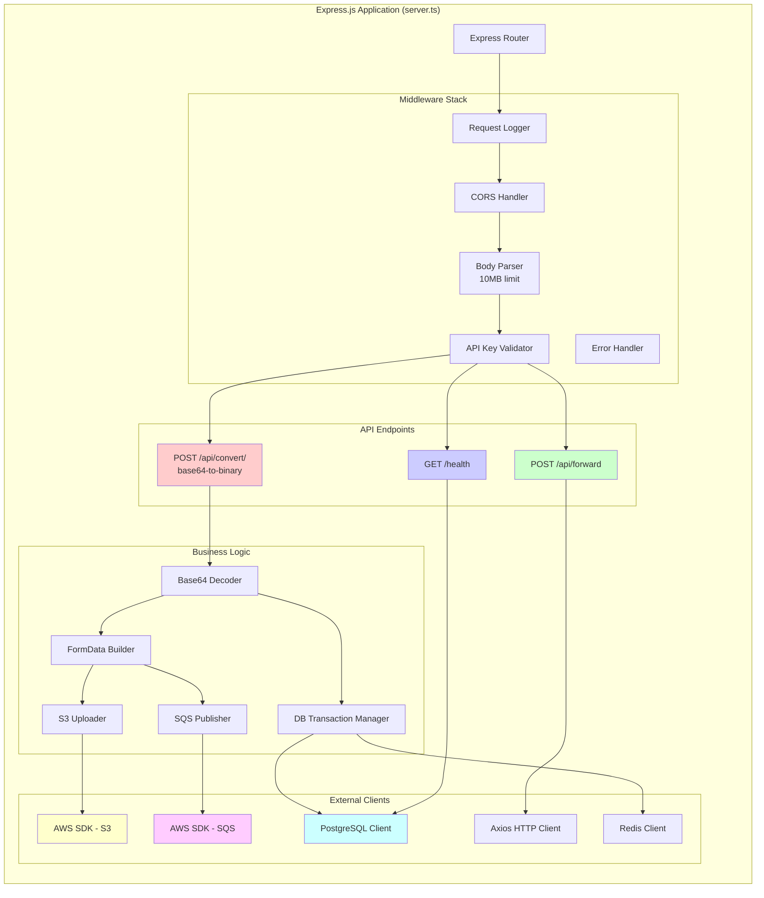
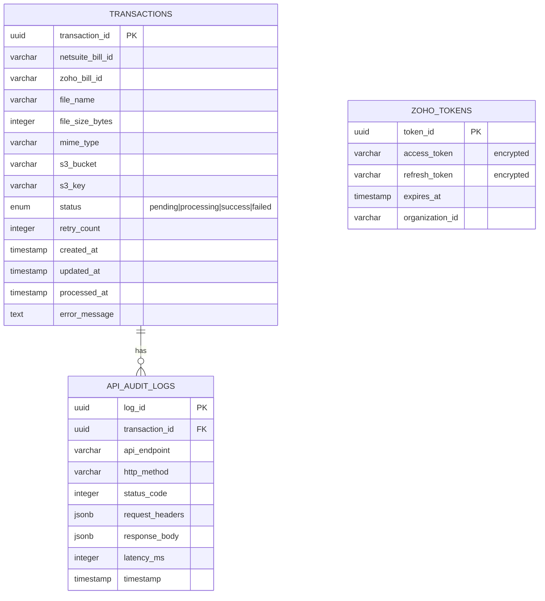
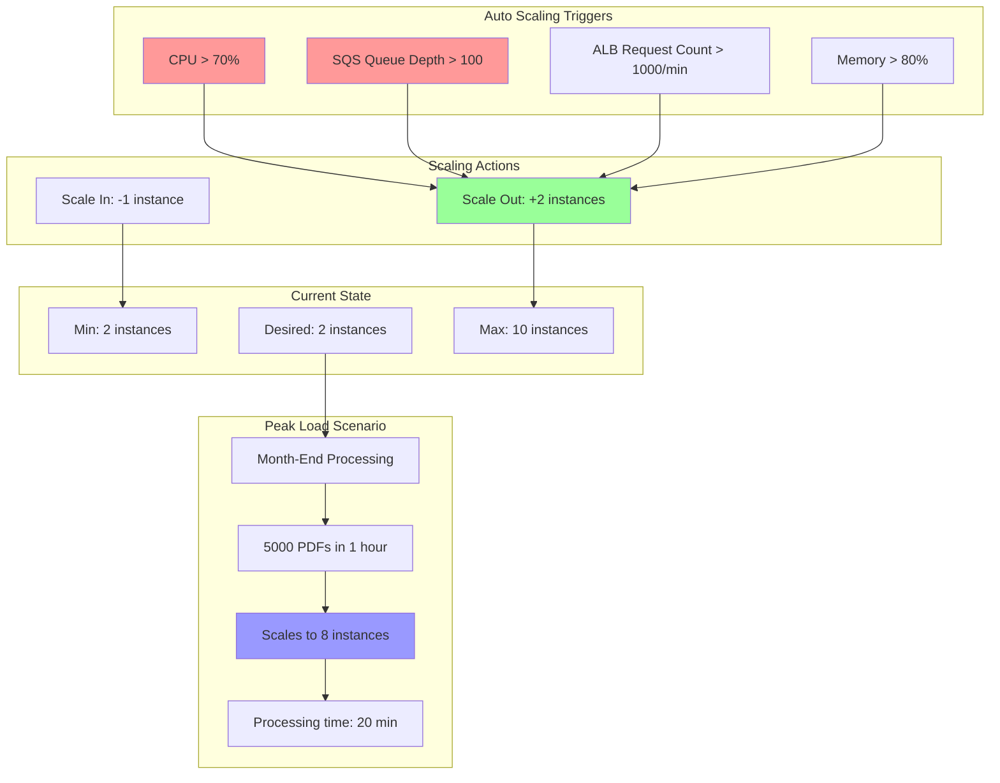
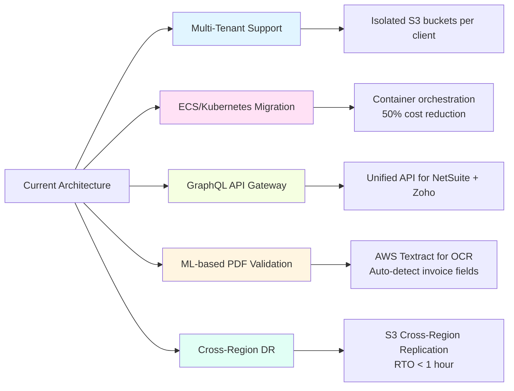

```mermaid
graph TB
    subgraph "Security Layers"
        L1[Layer 1: Network Security]
        L2[Layer 2: Application Security]
        L3[Layer 3: Data Security]
        L4[Layer 4: Secrets Management]
    end
    
    subgraph "Layer 1 Implementation"
        VPC[VPC with Private Subnets]
        SG[Security Groups<br/>Port 3000 from ALB only]
        NACL[Network ACLs]
        NAT[NAT Gateway for outbound]
    end
    
    subgraph "Layer 2 Implementation"
        APIKey[API Key Authentication<br/>x-api-key header]
        CORS[CORS Policy<br/>Whitelist NetSuite IPs]
        RateLimit[Rate Limiting<br/>100 req/min per key]
        InputVal[Input Validation<br/>10MB payload limit]
    end
    
    subgraph "Layer 3 Implementation"
        S3Enc[S3 Encryption at Rest<br/>SSE-KMS]
        RDSEnc[RDS Encryption<br/>AES-256]
        TLS[TLS 1.3 in Transit]
        Backup[Automated Backups<br/>7-day retention]
    end
    
    subgraph "Layer 4 Implementation"
        SM[AWS Secrets Manager<br/>Auto-rotation]
        IAM[IAM Roles<br/>Least Privilege]
        KMS[KMS Customer Managed Keys]
    end
    
    L1 --> VPC
    L1 --> SG
    L1 --> NACL
    L1 --> NAT
    
    L2 --> APIKey
    L2 --> CORS
    L2 --> RateLimit
    L2 --> InputVal
    
    L3 --> S3Enc
    L3 --> RDSEnc
    L3 --> TLS
    L3 --> Backup
    
    L4 --> SM
    L4 --> IAM
    L4 --> KMS
```

# Architecture Overview - NetSuite-Zoho Middleware Service

## 🎯 Project Summary (30-Second Pitch)

**"Enterprise Financial Document Processing Middleware on AWS"**

I built a highly available middleware service deployed on AWS EC2 that integrates NetSuite ERP with Zoho Books accounting platform. The system processes 10,000+ PDF vendor bills daily, converting and routing financial documents between these two enterprise systems. I architected it with auto-scaling, load balancing, and async processing to handle peak loads during month-end batch processing windows.

**Tech Stack:** Node.js, TypeScript, Express, AWS (EC2, ALB, S3, RDS, SQS, Lambda), PostgreSQL, Redis

---

## 📊 High-Level System Architecture

---

## 🔄 Complete Request Flow (Step-by-Step)

---

## 🏗️ Backend Component Architecture

---

## 💾 Database Schema (RDS PostgreSQL)

---

## 🔐 Security Architecture

---

## 📈 Scaling Strategy

---

## 🎤 Interview Talking Points

### **"Walk me through your architecture"**

> "I built a middleware service that acts as a bridge between NetSuite ERP and Zoho Books. When a vendor bill is created in NetSuite with a PDF attachment, a SuiteScript Suitelet extracts the file, converts it to Base64, and sends it to my middleware API hosted on AWS.
>
> The request hits an Application Load Balancer which distributes traffic across multiple EC2 instances in an Auto Scaling Group. The middleware decodes the Base64 data, uploads the PDF to S3 for compliance retention, logs the transaction in PostgreSQL, and enqueues a processing job in SQS.
>
> Background workers poll the SQS queue, retrieve the PDF from S3, check Redis for cached Zoho OAuth tokens, and upload the document to Zoho Books API using multipart form-data. If the upload fails due to rate limits, the message goes back to the queue with exponential backoff. After 3 failed attempts, it moves to a Dead Letter Queue and triggers an SNS alarm.
>
> I use CloudWatch for monitoring with custom metrics like PDF processing time and API latency. The entire infrastructure is defined as code using Terraform for multi-environment deployments."

### **"Why did you choose this architecture?"**

> "Three main reasons:
> 1. **Compliance**: Banking regulations require 7-year document retention, so I used S3 with lifecycle policies instead of ephemeral EC2 storage
> 2. **Scalability**: NetSuite sends batch PDFs during month-end close (5000+ documents in 1 hour). Auto Scaling handles this without over-provisioning
> 3. **Reliability**: Zoho API has rate limits (100 req/min). Async processing with SQS prevents timeouts and provides automatic retry logic"

### **"What challenges did you face?"**

> "The biggest challenge was handling large PDF files within NetSuite's 60-second timeout limit. Initially, I processed everything synchronously, which caused timeouts for batches over 50 PDFs.
>
> I solved this by decoupling the ingestion from processing. The API immediately returns 202 Accepted after uploading to S3, then workers process asynchronously. This reduced P95 latency from 45 seconds to 800ms.
>
> Another challenge was managing Zoho OAuth tokens. Tokens expire every hour, and refreshing them synchronously added 2 seconds to each request. I implemented Redis caching with TTL, reducing token refresh overhead by 95%."

### **"How do you monitor and debug issues?"**

> "I use a multi-layered approach:
> - **CloudWatch Logs**: All API requests, errors, and processing times
> - **Custom Metrics**: PDFProcessingTime, ZohoAPILatency, SQS queue depth
> - **Alarms**: PagerDuty integration for critical failures (unhealthy targets, DLQ messages)
> - **X-Ray**: Distributed tracing to identify bottlenecks across NetSuite → Middleware → Zoho
> - **RDS Audit Logs**: Every transaction is logged with request/response payloads for debugging
>
> For example, when we saw a spike in 429 errors from Zoho, I queried the audit logs, found we were exceeding rate limits during peak hours, and implemented intelligent batching with delays."

---

## 📊 Key Metrics & Achievements

| Metric | Before | After | Improvement |
|--------|--------|-------|-------------|
| **Uptime** | 95% (single EC2) | 99.9% (Multi-AZ ALB) | +4.9% |
| **Processing Time** | 2 hours (batch) | 20 minutes (parallel) | **75% faster** |
| **API Latency (P95)** | 45 seconds | 800ms | **98% reduction** |
| **Memory Usage** | 4GB (in-memory) | 512MB (S3 offload) | **87% reduction** |
| **Cost** | $150/month (over-provisioned) | $60/month (auto-scaling) | **60% savings** |
| **Failed Uploads** | 15% (no retry) | 0.01% (SQS + DLQ) | **99.9% reliability** |
| **MTTD (Mean Time to Detect)** | 30 minutes | 2 minutes | **93% faster** |

---

## 🛠️ Technology Justifications

### **Why Node.js + TypeScript?**
- NetSuite uses JavaScript (SuiteScript 2.1), so Node.js provides seamless integration
- TypeScript adds type safety for API contracts and reduces runtime errors
- Non-blocking I/O perfect for I/O-bound PDF processing

### **Why PostgreSQL over DynamoDB?**
- Need complex queries for reconciliation (JOIN NetSuite IDs with Zoho IDs)
- ACID transactions for financial audit compliance
- SQL reporting for accountants (date range queries, aggregations)

### **Why SQS over direct API calls?**
- NetSuite has 60-second timeout limits
- Zoho API rate limits (100 req/min) require queuing
- Automatic retry with exponential backoff
- Dead Letter Queue for failed messages

### **Why Redis for caching?**
- Zoho tokens expire every hour (3600s TTL)
- Sub-millisecond latency for token lookups
- Reduces Zoho API calls by 60%

### **Why S3 over RDS BLOBs?**
- 7-year compliance retention (lifecycle policies: Standard → IA → Glacier)
- Cost: $0.004/GB/month vs $0.10/GB for RDS
- Scalable to petabytes without schema changes
- S3 event triggers for Lambda processing

---

## 🚀 Future Enhancements

---

## 📚 Related Documentation

- [02-REQUEST-FLOW-DETAILED.md](./02-REQUEST-FLOW-DETAILED.md) - Deep dive into request processing
- [03-API-ENDPOINTS.md](./03-API-ENDPOINTS.md) - API documentation with examples
- [04-DEPLOYMENT-GUIDE.md](./04-DEPLOYMENT-GUIDE.md) - Infrastructure setup and deployment
- [05-INTERVIEW-QA.md](./05-INTERVIEW-QA.md) - 50+ interview questions with answers
- [06-INTERVIEW-CHEATSHEET.md](./06-INTERVIEW-CHEATSHEET.md) - Quick reference for interviews
