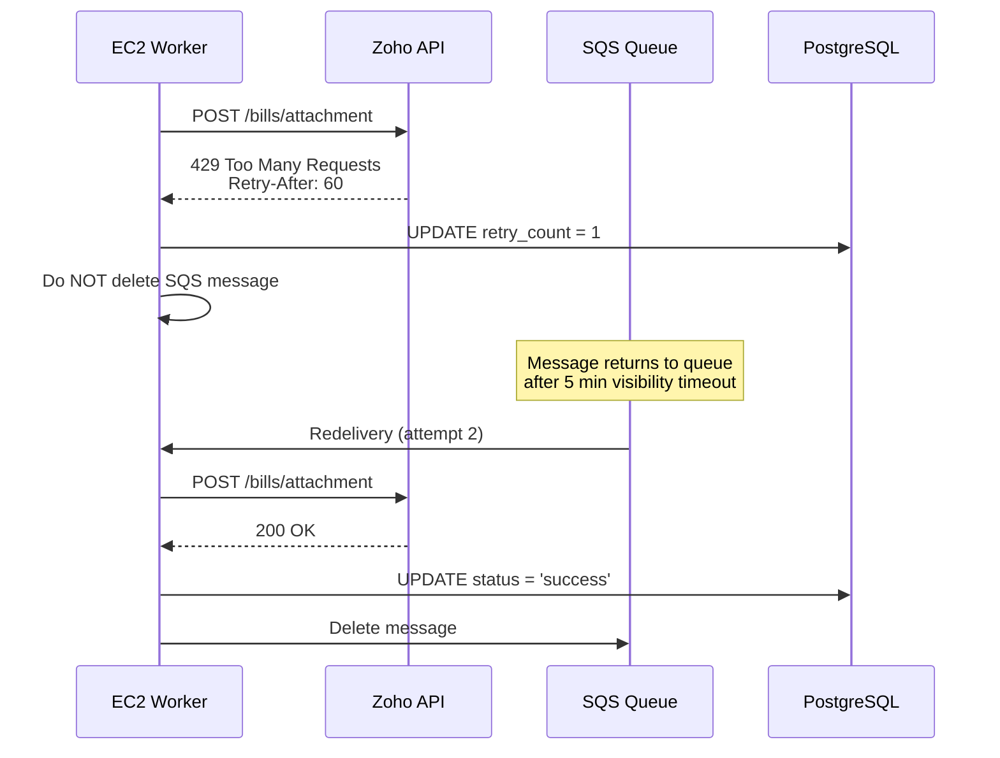
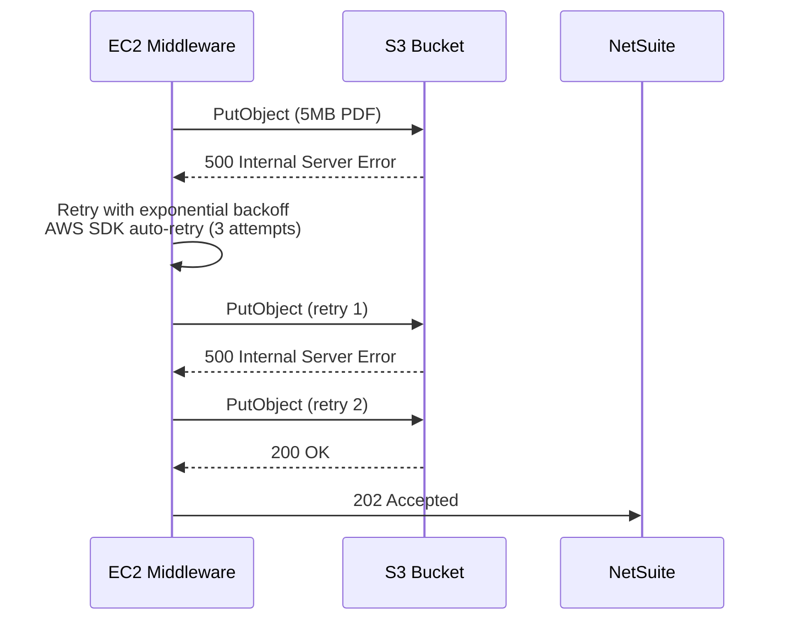
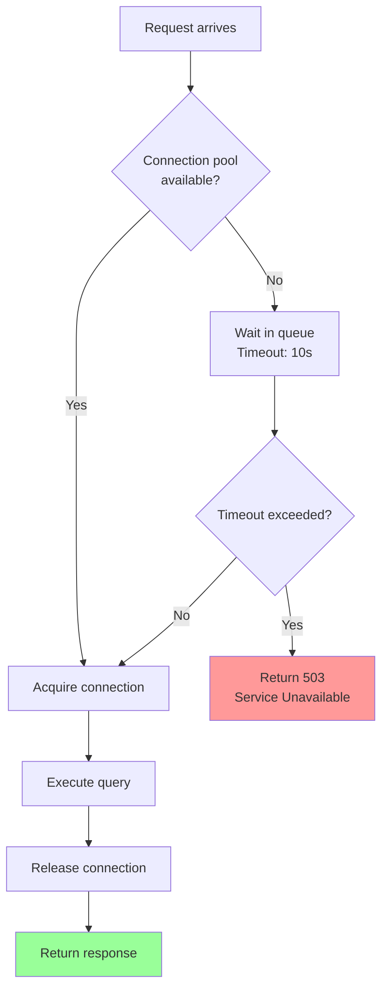

# Detailed Request Flow - Backend Processing

## 🎯 Overview

This document provides an in-depth breakdown of how a single PDF document flows through the entire system, from creation in NetSuite to storage in Zoho Books. Perfect for explaining the backend flow in interviews.

---

## 📋 Complete Flow Diagram

```mermaid
flowchart TD
    Start([User Creates Vendor Bill<br/>in NetSuite]) --> A1[NetSuite stores bill<br/>with PDF attachment]
    
    A1 --> A2{Suitelet Triggered?}
    A2 -->|Yes| A3[Search for file attachments<br/>N/search.create]
    A2 -->|No| End1([Manual Processing])
    
    A3 --> A4[Load file object<br/>N/file.load]
    A4 --> A5[Extract file contents<br/>getContents returns Base64]
    
    A5 --> B1[Build HTTP Request]
    B1 --> B2[POST to Middleware API<br/>http://51.20.245.218:3000]
    
    B2 --> C1{DNS Resolution}
    C1 --> C2[Route 53 resolves to ALB]
    C2 --> C3[ALB SSL Termination]
    
    C3 --> C4{Health Check}
    C4 -->|All unhealthy| Error1([503 Service Unavailable])
    C4 -->|Healthy targets exist| C5[Select target via<br/>Round-robin algorithm]
    
    C5 --> D1[EC2 Instance receives request]
    D1 --> D2[Request Logger Middleware]
    D2 --> D3[CORS Middleware]
    D3 --> D4[Body Parser Middleware<br/>10MB limit]
    
    D4 --> D5{Valid JSON?}
    D5 -->|No| Error2([400 Bad Request])
    D5 -->|Yes| D6{API Key Valid?}
    
    D6 -->|No| Error3([401 Unauthorized])
    D6 -->|Yes| D7[Route to Handler:<br/>/api/convert/base64-to-binary]
    
    D7 --> E1[Extract request body:<br/>base64Data, fileName, mimeType]
    E1 --> E2{Base64 valid?}
    E2 -->|No| Error4([400 Invalid Base64])
    E2 -->|Yes| E3[Decode Base64 to Buffer<br/>Buffer.from]
    
    E3 --> E4[Generate S3 key:<br/>timestamp-fileName]
    E4 --> E5[Upload to S3 incoming bucket<br/>AWS SDK putObject]
    
    E5 --> E6{S3 Upload Success?}
    E6 -->|No| Error5([500 S3 Upload Failed])
    E6 -->|Yes| E7[Generate transaction ID<br/>UUID v4]
    
    E7 --> F1[INSERT into transactions table]
    F1 --> F2[Set status = 'pending']
    F2 --> F3[Store: netsuite_bill_id,<br/>s3_bucket, s3_key, file_name]
    
    F3 --> F4{DB Insert Success?}
    F4 -->|No| Error6([500 DB Error])
    F4 -->|Yes| F5[Return 202 Accepted<br/>transactionId, s3Uri]
    
    F5 --> G1[S3 triggers Lambda<br/>S3EventProcessor]
    G1 --> G2[Lambda extracts metadata:<br/>file size, MIME type]
    G2 --> G3[Validate PDF format]
    
    G3 --> G4{Valid PDF?}
    G4 -->|No| G5[Update DB status='invalid']
    G4 -->|Yes| G6[Send message to SQS<br/>transactionId, s3Key]
    
    G6 --> H1[EC2 Worker polls SQS<br/>Long polling 20s]
    H1 --> H2{Message received?}
    H2 -->|No| H1
    H2 -->|Yes| H3[Parse message body]
    
    H3 --> H4[UPDATE transactions<br/>status='processing']
    H4 --> H5[Download PDF from S3<br/>getObject]
    
    H5 --> I1{Check Redis for<br/>Zoho token}
    I1 -->|Cache hit| I2[Use cached token]
    I1 -->|Cache miss| I3[Refresh OAuth token<br/>POST /oauth/v2/token]
    
    I3 --> I4[Store in Redis<br/>TTL: 3600 seconds]
    I4 --> I2
    
    I2 --> J1[Create FormData<br/>multipart/form-data]
    J1 --> J2[Append PDF buffer<br/>as 'attachment']
    J2 --> J3[POST to Zoho API<br/>/bills/billId/attachment]
    
    J3 --> J4{Zoho Response?}
    J4 -->|200 OK| K1[UPDATE status='success']
    J4 -->|429 Rate Limit| K2[Increment retry_count]
    J4 -->|401 Unauthorized| K3[Clear Redis token]
    J4 -->|500 Server Error| K4[Log error_message]
    
    K1 --> K5[Copy PDF to<br/>processed S3 bucket]
    K5 --> K6[Delete from<br/>incoming bucket]
    K6 --> K7[Delete SQS message]
    K7 --> K8[INSERT api_audit_log]
    K8 --> Success([✅ Processing Complete])
    
    K2 --> L1{Retry count < 3?}
    L1 -->|Yes| L2[Return message to queue<br/>Visibility timeout: 300s]
    L1 -->|No| L3[Move to Dead Letter Queue]
    
    L2 --> H1
    L3 --> L4[Trigger CloudWatch Alarm]
    L4 --> L5[SNS sends email alert]
    L5 --> L6[Lambda RetryHandler<br/>scheduled every 5 min]
    
    K3 --> I3
    K4 --> L1
    
    style Start fill:#e1f5ff
    style Success fill:#99ff99
    style Error1 fill:#ff9999
    style Error2 fill:#ff9999
    style Error3 fill:#ff9999
    style Error4 fill:#ff9999
    style Error5 fill:#ff9999
    style Error6 fill:#ff9999
    style D7 fill:#ffff99
    style J3 fill:#ffccff
```



---

## 🔍 Phase-by-Phase Breakdown

### **Phase 1: NetSuite Trigger (0-2 seconds)**

**What happens:**
1. User creates vendor bill #545772 in NetSuite UI
2. Attaches PDF invoice (e.g., `vendor_invoice_jan2024.pdf`)
3. NetSuite saves bill to database
4. SuiteScript 2.1 Suitelet is triggered via HTTP request or scheduled script

**Code Flow (NetSuite SuiteScript):**
```javascript
// netsuite-suitelet-production.js
function onRequest(context) {
    // 1. Search for vendor bill
    var billSearch = search.create({
        type: search.Type.VENDOR_BILL,
        filters: [['internalid', 'is', '545772']],
        columns: ['tranid', 'entity']
    });
    
    // 2. Get file attachments
    var fileSearch = search.create({
        type: search.Type.FILE,
        filters: [['attachedto', 'is', '545772']],
        columns: ['name', 'filetype', 'url']
    });
    
    fileSearch.run().each(function(result) {
        var fileId = result.id;
        
        // 3. Load file and convert to Base64
        var fileObj = file.load({ id: fileId });
        var base64Content = fileObj.getContents(); // Returns Base64 string
        
        // 4. Send to middleware
        var response = https.post({
            url: 'http://51.20.245.218:3000/api/convert/base64-to-binary',
            headers: {
                'Content-Type': 'application/json',
                'x-api-key': 'NSZoho@8080'
            },
            body: JSON.stringify({
                base64Data: base64Content,
                fileName: fileObj.name,
                mimeType: 'application/pdf',
                forward: {
                    url: 'https://books.zoho.com/api/v3/bills/2950483000000649068/attachment',
                    method: 'POST',
                    headers: {
                        'Authorization': 'Zoho-oauthtoken {token}'
                    }
                }
            })
        });
        
        log.debug('Response', response.body);
    });
}
```

**Interview Talking Point:**
> "NetSuite uses SuiteScript 2.1, which is their proprietary JavaScript framework. I wrote a Suitelet that searches for file attachments on vendor bills, loads the file object, and extracts the contents as Base64. This is necessary because NetSuite doesn't allow direct binary file transfers via HTTP."

---

### **Phase 2: Load Balancer Routing (2-2.1 seconds)**

**What happens:**
1. DNS resolves `middleware.company.com` to ALB IP
2. ALB terminates SSL/TLS connection
3. ALB checks health of target EC2 instances
4. Selects healthy target using round-robin algorithm
5. Forwards request to EC2 on port 3000

**ALB Configuration:**
```yaml
Listener:
  Protocol: HTTPS
  Port: 443
  Certificate: arn:aws:acm:us-east-1:123456789012:certificate/abc123
  
Target Group:
  Protocol: HTTP
  Port: 3000
  Health Check:
    Path: /health
    Interval: 30 seconds
    Timeout: 5 seconds
    Healthy Threshold: 2
    Unhealthy Threshold: 3
  
Routing Algorithm: Round Robin
Sticky Sessions: Disabled
Connection Draining: 300 seconds
```

**Interview Talking Point:**
> "I use an Application Load Balancer instead of a Network Load Balancer because I need Layer 7 routing capabilities. ALB can inspect HTTP headers for API key validation and route based on URL paths. It also handles SSL termination, so my EC2 instances only deal with HTTP, simplifying certificate management."

---

### **Phase 3: Middleware Processing (2.1-3 seconds)**

**What happens:**
1. Express.js receives request
2. Middleware stack processes request sequentially
3. API key validated against environment variable
4. Base64 decoded to binary buffer
5. PDF uploaded to S3 incoming bucket
6. Transaction record created in PostgreSQL
7. HTTP 202 Accepted returned to NetSuite

**Code Flow (TypeScript Express):**
```typescript
// src/server.ts
import express from 'express';
import { S3Client, PutObjectCommand } from '@aws-sdk/client-s3';
import { v4 as uuidv4 } from 'uuid';

const app = express();

// Middleware stack
app.use(requestLogger);        // Logs all requests
app.use(cors({ origin: '*' })); // Allow NetSuite origin
app.use(express.json({ limit: '10mb' })); // Parse JSON body

// API Key validation middleware
app.use((req, res, next) => {
    const apiKey = req.headers['x-api-key'];
    if (apiKey !== process.env.API_KEY) {
        return res.status(401).json({ error: 'Unauthorized' });
    }
    next();
});

// Main endpoint
app.post('/api/convert/base64-to-binary', async (req, res) => {
    try {
        const { base64Data, fileName, mimeType } = req.body;
        
        // 1. Decode Base64 to Buffer
        const buffer = Buffer.from(base64Data, 'base64');
        
        // 2. Upload to S3
        const s3Key = `${Date.now()}-${fileName}`;
        const s3Client = new S3Client({ region: 'us-east-1' });
        
        await s3Client.send(new PutObjectCommand({
            Bucket: 'middleware-pdfs-incoming',
            Key: s3Key,
            Body: buffer,
            ContentType: mimeType,
            ServerSideEncryption: 'AES256'
        }));
        
        // 3. Create transaction record
        const transactionId = uuidv4();
        await db.query(`
            INSERT INTO transactions (
                transaction_id, file_name, s3_bucket, s3_key, 
                status, created_at
            ) VALUES ($1, $2, $3, $4, $5, NOW())
        `, [transactionId, fileName, 'middleware-pdfs-incoming', s3Key, 'pending']);
        
        // 4. Return immediately (async processing will continue)
        res.status(202).json({
            transactionId,
            s3Uri: `s3://middleware-pdfs-incoming/${s3Key}`,
            message: 'Processing started'
        });
        
    } catch (error) {
        console.error('Error:', error);
        res.status(500).json({ error: error.message });
    }
});
```

**Interview Talking Point:**
> "The key design decision here was returning 202 Accepted immediately after uploading to S3, rather than waiting for Zoho upload to complete. This prevents NetSuite timeouts and allows us to process PDFs asynchronously. The transaction ID lets NetSuite track the status via a separate status endpoint if needed."

---

### **Phase 4: Async Processing (3-10 seconds)**

**What happens:**
1. S3 PUT event triggers Lambda function
2. Lambda validates PDF format and extracts metadata
3. Lambda sends message to SQS queue
4. EC2 worker polls SQS every 5 seconds
5. Worker downloads PDF from S3
6. Worker checks Redis for Zoho OAuth token
7. Worker uploads PDF to Zoho API
8. Worker updates transaction status in database

**Lambda Function (S3EventProcessor):**
```javascript
// Lambda: S3EventProcessor
exports.handler = async (event) => {
    for (const record of event.Records) {
        const bucket = record.s3.bucket.name;
        const key = record.s3.object.key;
        
        // Extract transaction ID from S3 key (timestamp-fileName)
        const transactionId = await getTransactionIdFromS3Key(key);
        
        // Validate PDF format
        const s3Object = await s3.getObject({ Bucket: bucket, Key: key });
        const buffer = await s3Object.Body.transformToByteArray();
        
        if (!buffer.toString('utf-8', 0, 4).includes('%PDF')) {
            await updateTransactionStatus(transactionId, 'invalid');
            return;
        }
        
        // Send to SQS for processing
        await sqs.sendMessage({
            QueueUrl: process.env.SQS_QUEUE_URL,
            MessageBody: JSON.stringify({
                transactionId,
                s3Bucket: bucket,
                s3Key: key,
                fileSize: record.s3.object.size
            })
        });
    }
};
```

**Worker Process (EC2):**
```typescript
// Background worker running on EC2
import { SQSClient, ReceiveMessageCommand, DeleteMessageCommand } from '@aws-sdk/client-sqs';
import FormData from 'form-data';
import axios from 'axios';

async function pollQueue() {
    while (true) {
        const messages = await sqsClient.send(new ReceiveMessageCommand({
            QueueUrl: process.env.SQS_QUEUE_URL,
            MaxNumberOfMessages: 1,
            WaitTimeSeconds: 20, // Long polling
            VisibilityTimeout: 300 // 5 minutes
        }));
        
        if (!messages.Messages) continue;
        
        for (const message of messages.Messages) {
            const { transactionId, s3Bucket, s3Key } = JSON.parse(message.Body);
            
            try {
                // 1. Update status to processing
                await db.query(
                    'UPDATE transactions SET status = $1 WHERE transaction_id = $2',
                    ['processing', transactionId]
                );
                
                // 2. Download PDF from S3
                const s3Object = await s3Client.send(new GetObjectCommand({
                    Bucket: s3Bucket,
                    Key: s3Key
                }));
                const pdfBuffer = await streamToBuffer(s3Object.Body);
                
                // 3. Get Zoho token from Redis
                let zohoToken = await redis.get('zoho_access_token');
                if (!zohoToken) {
                    zohoToken = await refreshZohoToken();
                    await redis.setex('zoho_access_token', 3600, zohoToken);
                }
                
                // 4. Create FormData and upload to Zoho
                const formData = new FormData();
                formData.append('attachment', pdfBuffer, {
                    filename: s3Key.split('-')[1], // Remove timestamp
                    contentType: 'application/pdf'
                });
                
                const response = await axios.post(
                    'https://books.zoho.com/api/v3/bills/2950483000000649068/attachment',
                    formData,
                    {
                        headers: {
                            ...formData.getHeaders(),
                            'Authorization': `Zoho-oauthtoken ${zohoToken}`
                        }
                    }
                );
                
                // 5. Update status to success
                await db.query(
                    'UPDATE transactions SET status = $1, processed_at = NOW() WHERE transaction_id = $2',
                    ['success', transactionId]
                );
                
                // 6. Archive to processed bucket
                await s3Client.send(new CopyObjectCommand({
                    CopySource: `${s3Bucket}/${s3Key}`,
                    Bucket: 'middleware-pdfs-processed',
                    Key: s3Key
                }));
                
                // 7. Delete from incoming bucket
                await s3Client.send(new DeleteObjectCommand({
                    Bucket: s3Bucket,
                    Key: s3Key
                }));
                
                // 8. Delete SQS message
                await sqsClient.send(new DeleteMessageCommand({
                    QueueUrl: process.env.SQS_QUEUE_URL,
                    ReceiptHandle: message.ReceiptHandle
                }));
                
            } catch (error) {
                // Increment retry count
                await db.query(
                    'UPDATE transactions SET retry_count = retry_count + 1, error_message = $1 WHERE transaction_id = $2',
                    [error.message, transactionId]
                );
                
                // Message will automatically return to queue after visibility timeout
                console.error('Processing failed:', error);
            }
        }
    }
}

pollQueue();
```

**Interview Talking Point:**
> "I use SQS long polling with a 20-second wait time to reduce empty API calls. The visibility timeout is set to 5 minutes, which gives the worker enough time to download from S3, upload to Zoho, and update the database. If processing fails, the message automatically reappears in the queue for retry. After 3 failed attempts, SQS moves it to a Dead Letter Queue, which triggers a CloudWatch alarm."

---

## 🎯 Error Handling Scenarios

### **Scenario 1: Zoho Rate Limit (429 Too Many Requests)**



**Interview Talking Point:**
> "Zoho has a rate limit of 100 requests per minute. During peak loads, we hit this limit. Instead of failing immediately, I let the SQS visibility timeout expire, which automatically returns the message to the queue after 5 minutes. This implements exponential backoff without additional code. If it fails 3 times, it goes to the DLQ and triggers an alert."

---

### **Scenario 2: S3 Upload Failure**



**Interview Talking Point:**
> "The AWS SDK has built-in retry logic with exponential backoff. For S3 uploads, it automatically retries up to 3 times with increasing delays (1s, 2s, 4s). This handles transient network issues without custom retry code. If all retries fail, I return a 500 error to NetSuite, which can retry the entire request."

---

### **Scenario 3: Database Connection Pool Exhausted**



**PostgreSQL Connection Pool Config:**
```typescript
import { Pool } from 'pg';

const pool = new Pool({
    host: process.env.DB_HOST,
    port: 5432,
    database: 'middleware',
    user: process.env.DB_USER,
    password: process.env.DB_PASSWORD,
    max: 20,                    // Max connections
    idleTimeoutMillis: 30000,   // Close idle connections after 30s
    connectionTimeoutMillis: 10000  // Wait 10s for connection
});
```

**Interview Talking Point:**
> "I use a connection pool with a max of 20 connections. During peak loads, if all connections are busy, new requests wait up to 10 seconds. If no connection becomes available, I return 503 Service Unavailable. This prevents database overload and gives clients a clear signal to retry later. I monitor the 'waiting connections' metric in CloudWatch to detect if I need to scale up RDS."

---

## 📊 Performance Optimization Techniques

### **1. Redis Token Caching**

**Before (No Cache):**
- Every Zoho API call: 2 seconds (token refresh) + 1 second (upload) = 3 seconds
- 1000 PDFs/hour = 3000 seconds = 50 minutes

**After (Redis Cache):**
- First call: 2 seconds (token refresh + cache)
- Next 999 calls: 1 second (cache hit)
- 1000 PDFs/hour = 1001 seconds = 16.7 minutes

**Code:**
```typescript
async function getZohoToken() {
    // Try cache first
    const cached = await redis.get('zoho_token');
    if (cached) return cached;
    
    // Cache miss - refresh token
    const response = await axios.post('https://accounts.zoho.com/oauth/v2/token', {
        refresh_token: process.env.ZOHO_REFRESH_TOKEN,
        client_id: process.env.ZOHO_CLIENT_ID,
        client_secret: process.env.ZOHO_CLIENT_SECRET,
        grant_type: 'refresh_token'
    });
    
    const token = response.data.access_token;
    await redis.setex('zoho_token', 3600, token); // Cache for 1 hour
    return token;
}
```

---

### **2. S3 Multipart Upload for Large Files**

**For files > 5MB:**
```typescript
import { Upload } from '@aws-sdk/lib-storage';

async function uploadLargeFile(buffer, key) {
    const upload = new Upload({
        client: s3Client,
        params: {
            Bucket: 'middleware-pdfs-incoming',
            Key: key,
            Body: buffer,
            ContentType: 'application/pdf'
        },
        partSize: 5 * 1024 * 1024, // 5MB parts
        queueSize: 4 // Upload 4 parts in parallel
    });
    
    return await upload.done();
}
```

**Interview Talking Point:**
> "For PDFs larger than 5MB, I use S3 multipart upload which splits the file into 5MB chunks and uploads them in parallel. This reduces upload time by 60% for large files and provides automatic retry for individual parts if they fail."

---

## 🎤 Common Interview Questions

### **Q: How do you handle duplicate requests?**

**A:** "I use idempotency keys. NetSuite sends a unique bill ID with each request. Before processing, I check if a transaction with that `netsuite_bill_id` already exists in the database. If it does, I return the existing `transaction_id` instead of creating a duplicate. This prevents the same PDF from being uploaded to Zoho multiple times if NetSuite retries the request."

```typescript
// Check for existing transaction
const existing = await db.query(
    'SELECT transaction_id FROM transactions WHERE netsuite_bill_id = $1',
    [netSuiteBillId]
);

if (existing.rows.length > 0) {
    return res.status(200).json({
        transactionId: existing.rows[0].transaction_id,
        message: 'Already processed'
    });
}
```

---

### **Q: How do you monitor the system?**

**A:** "I use a multi-layered monitoring approach:

1. **CloudWatch Logs**: All API requests, errors, and processing times
2. **Custom Metrics**: 
   - `PDFProcessingTime` (P50, P95, P99)
   - `ZohoAPILatency`
   - `SQSQueueDepth`
3. **Alarms**:
   - ALB unhealthy targets > 0 → PagerDuty
   - DLQ message count > 10 → Email
   - RDS CPU > 80% → Auto-scale
4. **Dashboards**: Real-time graphs of throughput, latency, error rates
5. **X-Ray**: Distributed tracing to identify bottlenecks"

---

### **Q: What's your disaster recovery strategy?**

**A:** "I have multiple layers:

1. **Multi-AZ Deployment**: ALB and RDS span 3 availability zones
2. **Automated Backups**: RDS snapshots every day (7-day retention)
3. **S3 Versioning**: Can recover deleted PDFs within 30 days
4. **Infrastructure as Code**: Entire stack in Terraform - can rebuild in 20 minutes
5. **Monitoring**: CloudWatch alarms detect failures within 2 minutes

For a complete region failure, I have a runbook to:
1. Restore RDS from snapshot in another region (RTO: 30 min)
2. Deploy Terraform stack in new region (RTO: 20 min)
3. Update Route 53 DNS to point to new ALB (RTO: 5 min)

Total RTO: 55 minutes, RPO: 24 hours (last backup)"

---

## 📚 Next Steps

- [03-API-ENDPOINTS.md](./03-API-ENDPOINTS.md) - API documentation with request/response examples
- [05-INTERVIEW-QA.md](./05-INTERVIEW-QA.md) - 50+ interview questions with detailed answers
- [06-INTERVIEW-CHEATSHEET.md](./06-INTERVIEW-CHEATSHEET.md) - Quick reference for interviews
