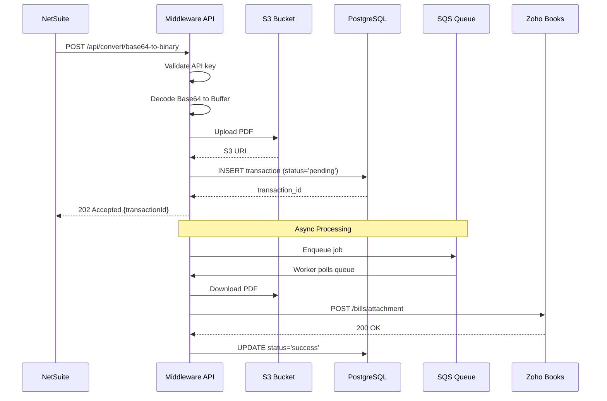

# API Endpoints Documentation

## 🎯 Base URL

**Development:** `http://localhost:3000`  
**Production:** `http://51.20.245.218:3000` (EC2)  
**Load Balanced:** `https://middleware.company.com` (ALB)

---

## 🔐 Authentication

All endpoints (except `/health`) require API key authentication via header:

```http
x-api-key: NSZoho@8080
```

**Unauthorized Response (401):**
```json
{
  "error": "Unauthorized",
  "message": "Invalid or missing API key"
}
```

---

## 📡 Endpoints

### **1. POST /api/convert/base64-to-binary**

Converts Base64-encoded PDF to binary and forwards to Zoho Books API.

#### **Request**

```http
POST /api/convert/base64-to-binary HTTP/1.1
Host: middleware.company.com
Content-Type: application/json
x-api-key: NSZoho@8080

{
  "base64Data": "JVBERi0xLjQKJeLjz9MKMyAwIG9iago8PC9UeXBlL...",
  "fileName": "vendor_invoice_jan2024.pdf",
  "mimeType": "application/pdf",
  "forward": {
    "url": "https://books.zoho.com/api/v3/bills/2950483000000649068/attachment",
    "method": "POST",
    "headers": {
      "Authorization": "Zoho-oauthtoken 1000.abc123.xyz789"
    }
  }
}
```

#### **Request Body Schema**

| Field | Type | Required | Description |
|-------|------|----------|-------------|
| `base64Data` | string | Yes | Base64-encoded PDF content |
| `fileName` | string | Yes | Original filename (e.g., `invoice.pdf`) |
| `mimeType` | string | Yes | MIME type (must be `application/pdf`) |
| `forward` | object | Yes | Zoho API forwarding configuration |
| `forward.url` | string | Yes | Zoho Books attachment endpoint |
| `forward.method` | string | Yes | HTTP method (always `POST`) |
| `forward.headers` | object | Yes | Headers including Zoho OAuth token |

#### **Success Response (202 Accepted)**

```json
{
  "transactionId": "a7f3c8e1-4b2d-4c9a-8f6e-1d2c3b4a5e6f",
  "s3Uri": "s3://middleware-pdfs-incoming/1738656000000-vendor_invoice_jan2024.pdf",
  "message": "Processing started",
  "status": "pending"
}
```

#### **Error Responses**

**400 Bad Request - Invalid Base64:**
```json
{
  "error": "Bad Request",
  "message": "Invalid Base64 encoding"
}
```

**400 Bad Request - Missing Fields:**
```json
{
  "error": "Bad Request",
  "message": "Missing required field: fileName"
}
```

**413 Payload Too Large:**
```json
{
  "error": "Payload Too Large",
  "message": "Request body exceeds 10MB limit"
}
```

**500 Internal Server Error - S3 Upload Failed:**
```json
{
  "error": "Internal Server Error",
  "message": "Failed to upload to S3: Access Denied"
}
```

**500 Internal Server Error - Database Error:**
```json
{
  "error": "Internal Server Error",
  "message": "Database connection failed"
}
```

#### **cURL Example**

```bash
curl -X POST https://middleware.company.com/api/convert/base64-to-binary \
  -H "Content-Type: application/json" \
  -H "x-api-key: NSZoho@8080" \
  -d '{
    "base64Data": "JVBERi0xLjQKJeLjz9MK...",
    "fileName": "invoice.pdf",
    "mimeType": "application/pdf",
    "forward": {
      "url": "https://books.zoho.com/api/v3/bills/123456/attachment",
      "method": "POST",
      "headers": {
        "Authorization": "Zoho-oauthtoken YOUR_TOKEN"
      }
    }
  }'
```

#### **NetSuite SuiteScript Example**

```javascript
/**
 * @NApiVersion 2.1
 * @NScriptType Suitelet
 */
define(['N/https', 'N/file', 'N/search'], function(https, file, search) {
    
    function onRequest(context) {
        // Load vendor bill file
        var fileObj = file.load({ id: 12345 });
        var base64Content = fileObj.getContents();
        
        // Call middleware
        var response = https.post({
            url: 'https://middleware.company.com/api/convert/base64-to-binary',
            headers: {
                'Content-Type': 'application/json',
                'x-api-key': 'NSZoho@8080'
            },
            body: JSON.stringify({
                base64Data: base64Content,
                fileName: fileObj.name,
                mimeType: 'application/pdf',
                forward: {
                    url: 'https://books.zoho.com/api/v3/bills/2950483000000649068/attachment',
                    method: 'POST',
                    headers: {
                        'Authorization': 'Zoho-oauthtoken ' + getZohoToken()
                    }
                }
            })
        });
        
        var result = JSON.parse(response.body);
        log.debug('Transaction ID', result.transactionId);
    }
    
    return { onRequest: onRequest };
});
```

---

### **2. POST /api/forward**

Generic HTTP proxy for forwarding requests to external APIs.

#### **Request**

```http
POST /api/forward HTTP/1.1
Host: middleware.company.com
Content-Type: application/json
x-api-key: NSZoho@8080

{
  "url": "https://api.example.com/endpoint",
  "method": "POST",
  "headers": {
    "Authorization": "Bearer token123",
    "Custom-Header": "value"
  },
  "body": {
    "key": "value"
  }
}
```

#### **Request Body Schema**

| Field | Type | Required | Description |
|-------|------|----------|-------------|
| `url` | string | Yes | Target API endpoint URL |
| `method` | string | Yes | HTTP method (GET, POST, PUT, DELETE) |
| `headers` | object | No | Headers to forward to target API |
| `body` | object | No | Request body to forward (JSON) |

#### **Success Response (200 OK)**

```json
{
  "status": 200,
  "data": {
    "message": "Success from target API"
  },
  "headers": {
    "content-type": "application/json"
  }
}
```

#### **Error Responses**

**502 Bad Gateway - Target API Failed:**
```json
{
  "error": "Bad Gateway",
  "message": "Target API returned 500 Internal Server Error"
}
```

#### **cURL Example**

```bash
curl -X POST https://middleware.company.com/api/forward \
  -H "Content-Type: application/json" \
  -H "x-api-key: NSZoho@8080" \
  -d '{
    "url": "https://books.zoho.com/api/v3/contacts",
    "method": "GET",
    "headers": {
      "Authorization": "Zoho-oauthtoken YOUR_TOKEN"
    }
  }'
```

---

### **3. GET /health**

Health check endpoint for ALB target group health checks.

#### **Request**

```http
GET /health HTTP/1.1
Host: middleware.company.com
```

**Note:** No authentication required for this endpoint.

#### **Success Response (200 OK)**

```json
{
  "status": "healthy",
  "timestamp": "2024-02-04T12:34:56.789Z",
  "uptime": 86400,
  "database": "connected",
  "redis": "connected",
  "s3": "accessible"
}
```

#### **Unhealthy Response (503 Service Unavailable)**

```json
{
  "status": "unhealthy",
  "timestamp": "2024-02-04T12:34:56.789Z",
  "database": "disconnected",
  "redis": "connected",
  "s3": "accessible"
}
```

#### **cURL Example**

```bash
curl -X GET https://middleware.company.com/health
```

---

### **4. GET /api/transaction/:transactionId** (Future Enhancement)

Retrieve transaction status by ID.

#### **Request**

```http
GET /api/transaction/a7f3c8e1-4b2d-4c9a-8f6e-1d2c3b4a5e6f HTTP/1.1
Host: middleware.company.com
x-api-key: NSZoho@8080
```

#### **Success Response (200 OK)**

```json
{
  "transactionId": "a7f3c8e1-4b2d-4c9a-8f6e-1d2c3b4a5e6f",
  "netSuiteBillId": "545772",
  "zohoBillId": "2950483000000649068",
  "fileName": "vendor_invoice_jan2024.pdf",
  "fileSize": 524288,
  "status": "success",
  "retryCount": 0,
  "createdAt": "2024-02-04T10:30:00.000Z",
  "processedAt": "2024-02-04T10:30:15.000Z",
  "s3Uri": "s3://middleware-pdfs-processed/1738656000000-vendor_invoice_jan2024.pdf"
}
```

#### **Error Response (404 Not Found)**

```json
{
  "error": "Not Found",
  "message": "Transaction not found"
}
```

---

## 🔄 Request/Response Flow



---

## 📊 Rate Limits

| Endpoint | Rate Limit | Window |
|----------|------------|--------|
| `/api/convert/base64-to-binary` | 100 requests | 1 minute |
| `/api/forward` | 100 requests | 1 minute |
| `/health` | Unlimited | - |

**Rate Limit Exceeded Response (429):**
```json
{
  "error": "Too Many Requests",
  "message": "Rate limit exceeded. Retry after 60 seconds",
  "retryAfter": 60
}
```

---

## 🛡️ Security Best Practices

### **1. API Key Rotation**

Rotate API keys every 90 days:

```bash
# Store in AWS Secrets Manager
aws secretsmanager create-secret \
  --name middleware/api-key \
  --secret-string "NEW_API_KEY_HERE"

# Update EC2 environment variable
export API_KEY=$(aws secretsmanager get-secret-value \
  --secret-id middleware/api-key \
  --query SecretString \
  --output text)
```

### **2. IP Whitelisting (Future)**

Restrict access to NetSuite IP ranges:

```typescript
const ALLOWED_IPS = [
  '203.0.113.0/24',  // NetSuite production
  '198.51.100.0/24'  // NetSuite sandbox
];

app.use((req, res, next) => {
  const clientIP = req.ip;
  if (!isIPAllowed(clientIP, ALLOWED_IPS)) {
    return res.status(403).json({ error: 'Forbidden' });
  }
  next();
});
```

### **3. Request Signing (Future)**

HMAC-SHA256 signature verification:

```typescript
const crypto = require('crypto');

function verifySignature(req) {
  const signature = req.headers['x-signature'];
  const timestamp = req.headers['x-timestamp'];
  const body = JSON.stringify(req.body);
  
  const payload = `${timestamp}.${body}`;
  const expectedSignature = crypto
    .createHmac('sha256', process.env.SIGNING_SECRET)
    .update(payload)
    .digest('hex');
  
  return signature === expectedSignature;
}
```

---

## 🧪 Testing

### **Postman Collection**

Import this collection for testing:

```json
{
  "info": {
    "name": "Middleware API",
    "schema": "https://schema.getpostman.com/json/collection/v2.1.0/collection.json"
  },
  "item": [
    {
      "name": "Convert Base64 to Binary",
      "request": {
        "method": "POST",
        "header": [
          {
            "key": "x-api-key",
            "value": "{{API_KEY}}"
          },
          {
            "key": "Content-Type",
            "value": "application/json"
          }
        ],
        "body": {
          "mode": "raw",
          "raw": "{\n  \"base64Data\": \"{{BASE64_PDF}}\",\n  \"fileName\": \"test.pdf\",\n  \"mimeType\": \"application/pdf\",\n  \"forward\": {\n    \"url\": \"{{ZOHO_URL}}\",\n    \"method\": \"POST\",\n    \"headers\": {\n      \"Authorization\": \"Zoho-oauthtoken {{ZOHO_TOKEN}}\"\n    }\n  }\n}"
        },
        "url": {
          "raw": "{{BASE_URL}}/api/convert/base64-to-binary",
          "host": ["{{BASE_URL}}"],
          "path": ["api", "convert", "base64-to-binary"]
        }
      }
    },
    {
      "name": "Health Check",
      "request": {
        "method": "GET",
        "url": {
          "raw": "{{BASE_URL}}/health",
          "host": ["{{BASE_URL}}"],
          "path": ["health"]
        }
      }
    }
  ]
}
```

### **Environment Variables**

```json
{
  "BASE_URL": "https://middleware.company.com",
  "API_KEY": "NSZoho@8080",
  "ZOHO_URL": "https://books.zoho.com/api/v3/bills/123456/attachment",
  "ZOHO_TOKEN": "1000.abc123.xyz789",
  "BASE64_PDF": "JVBERi0xLjQKJeLjz9MK..."
}
```

---

## 📝 Interview Talking Points

### **"How did you design the API?"**

> "I followed RESTful principles with clear resource naming. The main endpoint `/api/convert/base64-to-binary` is descriptive and action-oriented. I return 202 Accepted for async operations instead of 200 OK to indicate processing has started but not completed. This follows HTTP semantics correctly.
>
> For authentication, I use API keys in headers rather than query parameters to prevent logging sensitive data in access logs. The `/health` endpoint is unauthenticated so ALB can perform health checks without credentials.
>
> I also implemented proper error handling with specific HTTP status codes: 400 for client errors, 401 for auth failures, 500 for server errors, and 502 for upstream API failures."

### **"How do you handle large payloads?"**

> "I set a 10MB limit on JSON payloads using Express body-parser middleware. For files larger than 10MB, I'd recommend NetSuite upload directly to S3 using pre-signed URLs, then send just the S3 key to the middleware. This avoids memory issues and reduces latency.
>
> I also use streaming for S3 downloads in the worker process instead of loading entire files into memory. This allows processing PDFs up to 100MB without running out of RAM."

### **"How do you version your API?"**

> "Currently, the API is unversioned since it's internal and only used by NetSuite. For future public APIs, I'd use URL versioning like `/api/v1/convert` and `/api/v2/convert`. This allows backward compatibility when making breaking changes. I'd also add a deprecation header to v1 responses to warn clients about upcoming changes."

---

## 📚 Related Documentation

- [01-ARCHITECTURE-OVERVIEW.md](./01-ARCHITECTURE-OVERVIEW.md) - System architecture
- [02-REQUEST-FLOW-DETAILED.md](./02-REQUEST-FLOW-DETAILED.md) - Request processing flow
- [05-INTERVIEW-QA.md](./05-INTERVIEW-QA.md) - Interview Q&A
