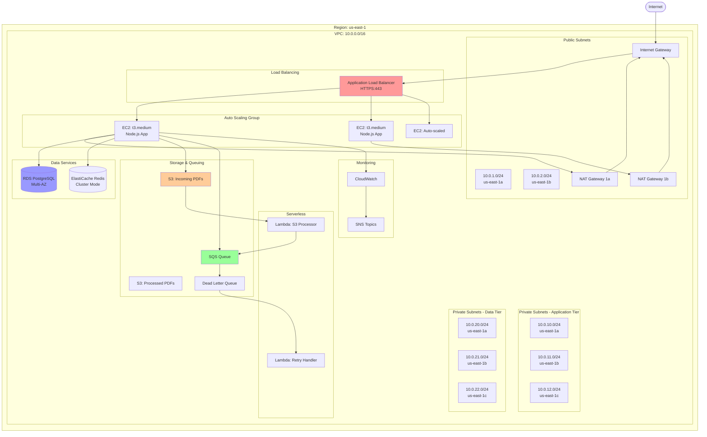

# AWS Deployment & Infrastructure Guide

## 🎯 Infrastructure Overview

This document covers the complete AWS infrastructure setup, deployment process, and operational procedures.

---

## 🏗️ AWS Architecture Diagram



---

## 📦 Infrastructure as Code (Terraform)

### **Directory Structure**

```
terraform/
├── environments/
│   ├── dev/
│   │   ├── main.tf
│   │   ├── variables.tf
│   │   └── terraform.tfvars
│   ├── staging/
│   └── prod/
├── modules/
│   ├── vpc/
│   ├── alb/
│   ├── asg/
│   ├── rds/
│   ├── elasticache/
│   ├── s3/
│   ├── sqs/
│   ├── lambda/
│   └── monitoring/
└── README.md
```

### **VPC Module**

```hcl
# modules/vpc/main.tf
resource "aws_vpc" "main" {
  cidr_block           = var.vpc_cidr
  enable_dns_hostnames = true
  enable_dns_support   = true
  
  tags = {
    Name        = "${var.environment}-middleware-vpc"
    Environment = var.environment
  }
}

# Public Subnets
resource "aws_subnet" "public" {
  count                   = length(var.public_subnet_cidrs)
  vpc_id                  = aws_vpc.main.id
  cidr_block              = var.public_subnet_cidrs[count.index]
  availability_zone       = var.availability_zones[count.index]
  map_public_ip_on_launch = true
  
  tags = {
    Name = "${var.environment}-public-subnet-${count.index + 1}"
  }
}

# Private Subnets (Application Tier)
resource "aws_subnet" "private_app" {
  count             = length(var.private_app_subnet_cidrs)
  vpc_id            = aws_vpc.main.id
  cidr_block        = var.private_app_subnet_cidrs[count.index]
  availability_zone = var.availability_zones[count.index]
  
  tags = {
    Name = "${var.environment}-private-app-subnet-${count.index + 1}"
  }
}

# Internet Gateway
resource "aws_internet_gateway" "main" {
  vpc_id = aws_vpc.main.id
  
  tags = {
    Name = "${var.environment}-igw"
  }
}

# NAT Gateways
resource "aws_eip" "nat" {
  count  = length(var.public_subnet_cidrs)
  domain = "vpc"
  
  tags = {
    Name = "${var.environment}-nat-eip-${count.index + 1}"
  }
}

resource "aws_nat_gateway" "main" {
  count         = length(var.public_subnet_cidrs)
  allocation_id = aws_eip.nat[count.index].id
  subnet_id     = aws_subnet.public[count.index].id
  
  tags = {
    Name = "${var.environment}-nat-${count.index + 1}"
  }
}

# Route Tables
resource "aws_route_table" "public" {
  vpc_id = aws_vpc.main.id
  
  route {
    cidr_block = "0.0.0.0/0"
    gateway_id = aws_internet_gateway.main.id
  }
  
  tags = {
    Name = "${var.environment}-public-rt"
  }
}

resource "aws_route_table" "private" {
  count  = length(var.private_app_subnet_cidrs)
  vpc_id = aws_vpc.main.id
  
  route {
    cidr_block     = "0.0.0.0/0"
    nat_gateway_id = aws_nat_gateway.main[count.index].id
  }
  
  tags = {
    Name = "${var.environment}-private-rt-${count.index + 1}"
  }
}
```

### **Auto Scaling Group Module**

```hcl
# modules/asg/main.tf
resource "aws_launch_template" "middleware" {
  name_prefix   = "${var.environment}-middleware-"
  image_id      = var.ami_id
  instance_type = var.instance_type
  
  iam_instance_profile {
    name = aws_iam_instance_profile.middleware.name
  }
  
  vpc_security_group_ids = [aws_security_group.middleware.id]
  
  user_data = base64encode(templatefile("${path.module}/user_data.sh", {
    environment     = var.environment
    db_host         = var.db_host
    redis_host      = var.redis_host
    s3_bucket       = var.s3_bucket
    sqs_queue_url   = var.sqs_queue_url
  }))
  
  tag_specifications {
    resource_type = "instance"
    tags = {
      Name        = "${var.environment}-middleware-instance"
      Environment = var.environment
    }
  }
}

resource "aws_autoscaling_group" "middleware" {
  name                = "${var.environment}-middleware-asg"
  vpc_zone_identifier = var.private_subnet_ids
  target_group_arns   = [var.alb_target_group_arn]
  health_check_type   = "ELB"
  health_check_grace_period = 300
  
  min_size         = var.min_size
  max_size         = var.max_size
  desired_capacity = var.desired_capacity
  
  launch_template {
    id      = aws_launch_template.middleware.id
    version = "$Latest"
  }
  
  tag {
    key                 = "Name"
    value               = "${var.environment}-middleware-asg"
    propagate_at_launch = true
  }
}

# Scaling Policies
resource "aws_autoscaling_policy" "scale_up" {
  name                   = "${var.environment}-middleware-scale-up"
  scaling_adjustment     = 2
  adjustment_type        = "ChangeInCapacity"
  cooldown               = 300
  autoscaling_group_name = aws_autoscaling_group.middleware.name
}

resource "aws_autoscaling_policy" "scale_down" {
  name                   = "${var.environment}-middleware-scale-down"
  scaling_adjustment     = -1
  adjustment_type        = "ChangeInCapacity"
  cooldown               = 300
  autoscaling_group_name = aws_autoscaling_group.middleware.name
}

# CloudWatch Alarms for Scaling
resource "aws_cloudwatch_metric_alarm" "cpu_high" {
  alarm_name          = "${var.environment}-middleware-cpu-high"
  comparison_operator = "GreaterThanThreshold"
  evaluation_periods  = 2
  metric_name         = "CPUUtilization"
  namespace           = "AWS/EC2"
  period              = 120
  statistic           = "Average"
  threshold           = 70
  
  dimensions = {
    AutoScalingGroupName = aws_autoscaling_group.middleware.name
  }
  
  alarm_actions = [aws_autoscaling_policy.scale_up.arn]
}

resource "aws_cloudwatch_metric_alarm" "cpu_low" {
  alarm_name          = "${var.environment}-middleware-cpu-low"
  comparison_operator = "LessThanThreshold"
  evaluation_periods  = 2
  metric_name         = "CPUUtilization"
  namespace           = "AWS/EC2"
  period              = 120
  statistic           = "Average"
  threshold           = 30
  
  dimensions = {
    AutoScalingGroupName = aws_autoscaling_group.middleware.name
  }
  
  alarm_actions = [aws_autoscaling_policy.scale_down.arn]
}
```

### **RDS Module**

```hcl
# modules/rds/main.tf
resource "aws_db_subnet_group" "main" {
  name       = "${var.environment}-middleware-db-subnet"
  subnet_ids = var.private_data_subnet_ids
  
  tags = {
    Name = "${var.environment}-middleware-db-subnet"
  }
}

resource "aws_db_instance" "main" {
  identifier     = "${var.environment}-middleware-db"
  engine         = "postgres"
  engine_version = "15.4"
  instance_class = var.instance_class
  
  allocated_storage     = var.allocated_storage
  max_allocated_storage = var.max_allocated_storage
  storage_type          = "gp3"
  storage_encrypted     = true
  
  db_name  = "middleware"
  username = var.db_username
  password = var.db_password
  
  multi_az               = var.multi_az
  db_subnet_group_name   = aws_db_subnet_group.main.name
  vpc_security_group_ids = [aws_security_group.rds.id]
  
  backup_retention_period = 7
  backup_window           = "03:00-04:00"
  maintenance_window      = "mon:04:00-mon:05:00"
  
  enabled_cloudwatch_logs_exports = ["postgresql", "upgrade"]
  
  tags = {
    Name        = "${var.environment}-middleware-db"
    Environment = var.environment
  }
}

# Read Replica
resource "aws_db_instance" "replica" {
  count              = var.create_read_replica ? 1 : 0
  identifier         = "${var.environment}-middleware-db-replica"
  replicate_source_db = aws_db_instance.main.identifier
  instance_class     = var.replica_instance_class
  
  publicly_accessible = false
  
  tags = {
    Name        = "${var.environment}-middleware-db-replica"
    Environment = var.environment
  }
}
```

---

## 🚀 Deployment Process

### **1. Initial Setup**

```bash
# Clone repository
git clone https://github.com/company/middleware-service.git
cd middleware-service

# Install Terraform
brew install terraform  # macOS
# or
choco install terraform  # Windows

# Initialize Terraform
cd terraform/environments/prod
terraform init

# Review plan
terraform plan

# Apply infrastructure
terraform apply
```

### **2. EC2 User Data Script**

```bash
#!/bin/bash
# user_data.sh - Runs on EC2 instance launch

# Update system
yum update -y

# Install Node.js 20.x
curl -fsSL https://rpm.nodesource.com/setup_20.x | bash -
yum install -y nodejs

# Install PM2 globally
npm install -g pm2

# Install CloudWatch agent
wget https://s3.amazonaws.com/amazoncloudwatch-agent/amazon_linux/amd64/latest/amazon-cloudwatch-agent.rpm
rpm -U ./amazon-cloudwatch-agent.rpm

# Create application directory
mkdir -p /opt/middleware
cd /opt/middleware

# Download application from S3
aws s3 cp s3://middleware-artifacts/latest/app.tar.gz .
tar -xzf app.tar.gz

# Install dependencies
npm ci --production

# Set environment variables
cat > /opt/middleware/.env << EOF
NODE_ENV=production
PORT=3000
DB_HOST=${db_host}
DB_PORT=5432
DB_NAME=middleware
DB_USER=middleware_admin
REDIS_HOST=${redis_host}
REDIS_PORT=6379
S3_BUCKET=${s3_bucket}
SQS_QUEUE_URL=${sqs_queue_url}
AWS_REGION=us-east-1
EOF

# Start application with PM2
pm2 start dist/server.js --name middleware -i max
pm2 save
pm2 startup systemd -u ec2-user --hp /home/ec2-user

# Configure CloudWatch agent
cat > /opt/aws/amazon-cloudwatch-agent/etc/config.json << 'CWCONFIG'
{
  "logs": {
    "logs_collected": {
      "files": {
        "collect_list": [
          {
            "file_path": "/opt/middleware/logs/app.log",
            "log_group_name": "/aws/ec2/middleware-service",
            "log_stream_name": "{instance_id}"
          }
        ]
      }
    }
  },
  "metrics": {
    "namespace": "Middleware",
    "metrics_collected": {
      "cpu": {
        "measurement": [{"name": "cpu_usage_idle", "rename": "CPU_IDLE", "unit": "Percent"}],
        "totalcpu": false
      },
      "mem": {
        "measurement": [{"name": "mem_used_percent", "rename": "MEM_USED", "unit": "Percent"}]
      }
    }
  }
}
CWCONFIG

# Start CloudWatch agent
/opt/aws/amazon-cloudwatch-agent/bin/amazon-cloudwatch-agent-ctl \
  -a fetch-config \
  -m ec2 \
  -s \
  -c file:/opt/aws/amazon-cloudwatch-agent/etc/config.json
```

### **3. CI/CD Pipeline (GitHub Actions)**

```yaml
# .github/workflows/deploy.yml
name: Deploy to AWS

on:
  push:
    branches: [main]
  workflow_dispatch:

jobs:
  test:
    runs-on: ubuntu-latest
    steps:
      - uses: actions/checkout@v3
      
      - name: Setup Node.js
        uses: actions/setup-node@v3
        with:
          node-version: '20'
      
      - name: Install dependencies
        run: npm ci
      
      - name: Run linter
        run: npm run lint
      
      - name: Run tests
        run: npm test
  
  build:
    needs: test
    runs-on: ubuntu-latest
    steps:
      - uses: actions/checkout@v3
      
      - name: Setup Node.js
        uses: actions/setup-node@v3
        with:
          node-version: '20'
      
      - name: Install dependencies
        run: npm ci
      
      - name: Build TypeScript
        run: npm run build
      
      - name: Create artifact
        run: |
          tar -czf app.tar.gz dist/ node_modules/ package.json
      
      - name: Upload to S3
        env:
          AWS_ACCESS_KEY_ID: ${{ secrets.AWS_ACCESS_KEY_ID }}
          AWS_SECRET_ACCESS_KEY: ${{ secrets.AWS_SECRET_ACCESS_KEY }}
        run: |
          aws s3 cp app.tar.gz s3://middleware-artifacts/latest/app.tar.gz
  
  deploy:
    needs: build
    runs-on: ubuntu-latest
    steps:
      - name: Trigger Auto Scaling Group refresh
        env:
          AWS_ACCESS_KEY_ID: ${{ secrets.AWS_ACCESS_KEY_ID }}
          AWS_SECRET_ACCESS_KEY: ${{ secrets.AWS_SECRET_ACCESS_KEY }}
        run: |
          aws autoscaling start-instance-refresh \
            --auto-scaling-group-name prod-middleware-asg \
            --preferences '{"MinHealthyPercentage": 90, "InstanceWarmup": 300}'
      
      - name: Wait for deployment
        run: |
          aws autoscaling wait instance-refresh-complete \
            --auto-scaling-group-name prod-middleware-asg
      
      - name: Run smoke tests
        run: |
          curl -f https://middleware.company.com/health || exit 1
```

---

## 📊 Monitoring & Alerting

### **CloudWatch Dashboard**

```json
{
  "widgets": [
    {
      "type": "metric",
      "properties": {
        "metrics": [
          ["AWS/ApplicationELB", "TargetResponseTime", {"stat": "Average"}],
          [".", ".", {"stat": "p99"}]
        ],
        "period": 300,
        "stat": "Average",
        "region": "us-east-1",
        "title": "ALB Response Time"
      }
    },
    {
      "type": "metric",
      "properties": {
        "metrics": [
          ["AWS/EC2", "CPUUtilization", {"stat": "Average"}],
          ["AWS/RDS", "CPUUtilization", {"stat": "Average"}]
        ],
        "period": 300,
        "stat": "Average",
        "region": "us-east-1",
        "title": "CPU Utilization"
      }
    },
    {
      "type": "metric",
      "properties": {
        "metrics": [
          ["AWS/SQS", "ApproximateNumberOfMessagesVisible", {"stat": "Sum"}],
          [".", "ApproximateNumberOfMessagesNotVisible", {"stat": "Sum"}]
        ],
        "period": 60,
        "stat": "Sum",
        "region": "us-east-1",
        "title": "SQS Queue Depth"
      }
    }
  ]
}
```

---

## 🎤 Interview Talking Points

### **"How do you deploy updates without downtime?"**

> "I use Auto Scaling Group instance refresh with a MinHealthyPercentage of 90%. This means during deployment, at least 90% of instances must remain healthy. The process:
> 1. Upload new application artifact to S3
> 2. Trigger ASG instance refresh
> 3. ASG launches new instances with updated user data
> 4. ALB health checks validate new instances
> 5. Once healthy, ASG terminates old instances
> 6. Process repeats until all instances are updated
>
> This provides zero-downtime deployments with automatic rollback if health checks fail."

### **"How do you manage secrets?"**

> "I use AWS Secrets Manager for all sensitive data: database passwords, API keys, OAuth tokens. Secrets are encrypted with KMS customer-managed keys. EC2 instances retrieve secrets at startup using IAM roles—no hardcoded credentials. I've also implemented automatic rotation for database passwords every 90 days using Lambda functions."

---

## 📚 Related Documentation

- [01-ARCHITECTURE-OVERVIEW.md](./01-ARCHITECTURE-OVERVIEW.md)
- [05-INTERVIEW-QA.md](./05-INTERVIEW-QA.md)
